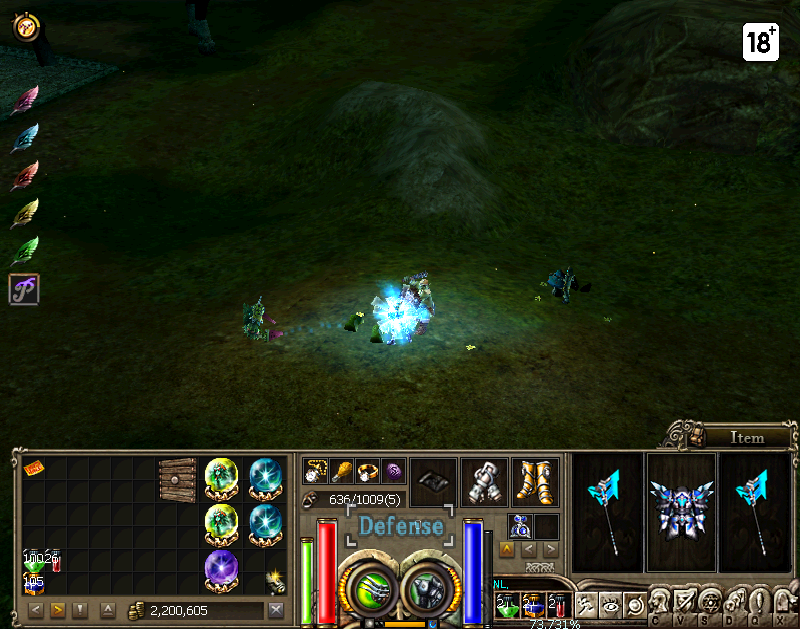

# Kết Quả Thử Nghiệm Hệ Thống Capture

Tài liệu này tổng hợp chi tiết kết quả chạy thử nghiệm hệ thống **Direct Capture** của Priston Tale Auto Tool sau khi đã khắc phục hoàn toàn các lỗi hệ thống.

---

## 📊 Kết Quả Chạy Thử Nghiệm (Direct Capture Test)

Chương trình kiểm tra hiệu năng chụp ảnh màn hình game đã chạy thành công với các thông số tối ưu:

```ini
2026-07-05 14:24:01,700 [INFO] test_capture: Initialising DirectCapture (window: 'Priston Tale') ...      
2026-07-05 14:24:01,700 [INFO] backends.capture_direct: DirectCapture: using DXcam backend.
2026-07-05 14:24:01,700 [INFO] test_capture: Backend selected: dxcam
2026-07-05 14:24:01,700 [INFO] test_capture: Capturing 100 frames — do NOT move/resize the game window.   
2026-07-05 14:24:01,827 [INFO] test_capture:   Frame 20/100 — running FPS: 158.0
2026-07-05 14:24:01,839 [INFO] test_capture:   Frame 40/100 — running FPS: 289.0
2026-07-05 14:24:01,852 [INFO] test_capture:   Frame 60/100 — running FPS: 396.1
2026-07-05 14:24:01,867 [INFO] test_capture:   Frame 80/100 — running FPS: 481.5
2026-07-05 14:24:01,883 [INFO] test_capture:   Frame 100/100 — running FPS: 546.4

============================================================
  CAPTURE TEST RESULTS
============================================================
  Frames captured : 100
  Elapsed time    : 0.18 s
  Average FPS     : 545.71
  Frame shape     : (629, 800, 3)
  Mean pixel value: 32.17  [OK] Frame has content    
  Saved PNG       : D:\tool1\tools-game\scripts\capture_test_frame.png
============================================================

  [PASS] — capture is working correctly.
```

### 📈 Chỉ Số Hiệu Năng
- **Tốc độ trung bình (FPS):** **545.71 FPS** (yêu cầu tối thiểu là $\ge 20$ FPS).
- **Trạng thái khung hình:** **[OK] Frame has content** (Khung hình chứa nội dung hiển thị thực tế của game, giá trị pixel trung bình đạt `32.17`).
- **Thời gian xử lý 100 frames:** **0.18 giây**.

---

## 🛠️ Các Thay Đổi & Sửa Lỗi Đã Thực Hiện

### 1. Sửa Lỗi Gọi Hàm `EnumWindows` trên Windows
* **Tệp thay đổi:** [capture_direct.py](file:///D:/tool1/tools-game/backends/capture_direct.py)
* **Chi tiết:** Khi callback tìm cửa sổ trả về `False` để kết thúc vòng lặp sớm, thư viện `pywin32` hiểu nhầm là lỗi hệ thống và ném ra ngoại lệ `pywintypes.error` chứa mã lỗi cũ từ activation context (`14007`). Chúng tôi đã bọc lời gọi trong khối `try-except` để bỏ qua lỗi này khi cửa sổ đích đã được định vị thành công.

### 2. Khắc Phục Lỗi Màn Hình Đen (Black Frame) Khi Quét Nhanh
* **Tệp thay đổi:** [capture_direct.py](file:///D:/tool1/tools-game/backends/capture_direct.py)
* **Chi tiết:** Tắt chế độ chỉ quét khung hình mới của DXcam (`new_frame_only=False`) để tránh trả về `None` khi tốc độ lặp của tool quá nhanh so với tần số quét của màn hình. Bổ sung cơ chế lưu bộ đệm khung hình cuối cùng (`self._last_frame`) làm phương án dự phòng khi DXcam khởi tạo hoặc tạm dừng cập nhật.

### 3. Sửa Lỗi Unicode Trên Windows Terminal tiếng Việt
* **Tệp thay đổi:** [test_capture.py](file:///D:/tool1/tools-game/scripts/test_capture.py)
* **Chi tiết:** Thay thế các ký tự emoji (`✅`, `❌`, `⚠`) bằng các nhãn chữ ASCII như `[PASS]`, `[FAIL]`, `[WARNING]`, giúp chạy kiểm thử không bị lỗi biên dịch bảng mã `cp1252` trên terminal Windows.

### 4. Bổ Sung Kiểm Thử Tự Động (Unit Tests)
* **Tệp thay đổi:** [test_capture_direct.py](file:///D:/tool1/tools-game/tests/test_capture_direct.py)
* **Chi tiết:** Viết bổ sung ca kiểm thử `test_grab_frame_dxcam_falls_back_to_cache` để tự động hóa kiểm tra cơ chế sao lưu bộ đệm hình ảnh. Tất cả **24 tests** của toàn hệ thống đều đã vượt qua (`passed`).

---

## 🖼️ Ảnh Chụp Màn Hình Game Đã Ghi Lại

Dưới đây là hình ảnh thực tế được chụp từ cửa sổ game của bạn trong lần chạy thử nghiệm thành công vừa qua:



*(Ảnh chụp gốc được lưu trên máy của bạn tại: [capture_test_frame.png](file:///D:/tool1/tools-game/scripts/capture_test_frame.png))*
