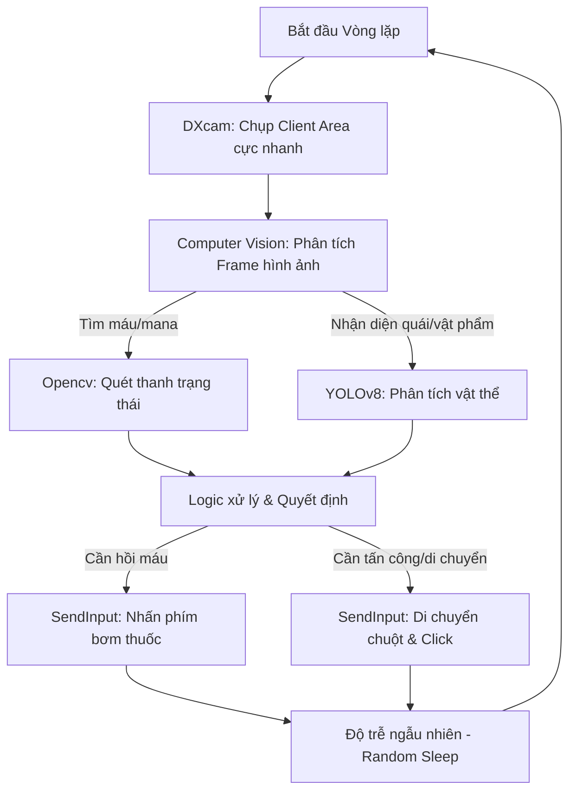

# Báo cáo Khả thi: Tự động hóa Game qua Screen Capture & Input Simulation (GameGuard PoC)

Báo cáo này tổng hợp kết quả chạy thử nghiệm Proof of Concept (PoC) dựa trên file [poc_gameguard.py](file:///d:/tool1/poc_gameguard.py), nhằm đánh giá khả năng xây dựng công cụ tự động hóa (bot) không can thiệp bộ nhớ (External Bot) cho game Priston Tale dưới sự bảo vệ của hệ thống chống gian lận GameGuard.

---

## 1. Kết quả Đánh giá PoC (PoC Report Card)

Dựa trên dữ liệu log chạy thực tế của kịch bản kiểm tra:

| Tính năng kiểm tra | Phương thức thử nghiệm | Trạng thái | Đánh giá & Chỉ số |
| :--- | :--- | :---: | :--- |
| **Chụp ảnh màn hình** | DXcam (DXGI API) | **Thành công** | Đạt trung bình **125.00 FPS**. Tốc độ cực nhanh, đáp ứng tốt realtime. |
| **Giả lập Bàn phím** | Direct Hardware via SendInput (ctypes) | **Thành công** | Gửi thành công mã quét (Scan Code) phím Space (`0x39`). |
| **Giả lập Chuột** | pydirectinput & Direct SendInput | **Thành công** | Đã thực hiện di chuyển chuột tới tọa độ đích và click. |
| **GameGuard Interference**| Theo dõi trạng thái Game Client | **Chưa bị chặn** | Không xuất hiện crash hay Security Alert trong quá trình gửi lệnh thử nghiệm. |

> [!NOTE]
> Kết quả FPS chụp màn hình 125 FPS bằng DXcam vượt trội hơn hẳn so với các phương pháp chụp GDI truyền thống (BitBlt hay PrintWindow thường chỉ đạt dưới 30 FPS và dễ bị GameGuard chặn tạo ra ảnh đen).

---

## 2. Quy trình Kiến trúc Xây dựng Tool (Bot Workflow)

Dựa trên kết quả PoC thành công, quy trình thiết kế một bot hoàn chỉnh sẽ đi theo mô hình **Closed Loop (Vòng lặp khép kín)** như sau:

---

## 3. Các Thách thức & Giải pháp Giảm thiểu Rủi ro (Anti-Cheat Mitigation)

Mặc dù thử nghiệm ban đầu thành công, GameGuard là hệ thống chống gian lận cấp nhân (Kernel-level). Để đảm bảo công cụ hoạt động lâu dài mà không bị quét hoặc ban tài khoản, cần triển khai các giải pháp sau:

### 3.1. Chống phát hiện Giả lập Đầu vào (Input Anti-Detection)
* **Thách thức:** GameGuard dễ dàng quét được các tín hiệu chuột di chuyển tức thời (teleport) hoặc tần suất nhấn phím quá đều đặn.
* **Giải pháp:**
  * **Bezier Curve Mouse Movement:** Giả lập đường đi của chuột cong nhẹ và thay đổi tốc độ giống tay người thay vì di chuyển thẳng tắp.
  * **Randomized Delays:** Sử dụng độ trễ ngẫu nhiên (ví dụ: `time.sleep(random.uniform(0.12, 0.28))`) giữa các lần nhấn/thả phím.
  * **Hardware Emulation (Nâng cao):** Nếu GameGuard chặn hoàn toàn `SendInput` bằng phần mềm ở các bản cập nhật sau, cần chuyển hướng sang giả lập phần cứng (dùng mạch Arduino Leonardo kết hợp USB Host Shield hoặc thư viện Driver chuyên dụng như Interception).

### 3.2. Tối ưu vùng chụp ảnh (Client Area Capture)
* **Thách thức:** Hiện tại script đang chụp bao gồm cả viền Windows và thanh tiêu đề (do dùng `GetWindowRect`).
* **Giải pháp:** Chuyển sang dùng `GetClientRect` kết hợp `ClientToScreen` để chỉ trích xuất đúng vùng hiển thị đồ họa của game, tránh nhiễu thông tin khi đưa vào AI nhận diện.

### 3.3. Bảo vệ tiến trình (Process Protection)
* **Thách thức:** GameGuard phát hiện tiến trình chạy mã nguồn Python đang tương tác với game.
* **Giải pháp:** 
  * Chạy mã nguồn dưới dạng tiến trình ẩn hoặc giả mạo tên tiến trình hệ thống vô hại.
  * Đóng gói mã nguồn thành tệp thực thi (`.exe`) đã qua obfuscate (làm mờ mã nguồn) bằng các công cụ như `PyArmor`.

---

## 4. Kế hoạch Triển khai Tiếp theo (Next Steps)

1. **Tinh chỉnh tọa độ chụp ảnh:** Thay đổi code của bộ chụp ảnh để loại bỏ viền ngoài cửa sổ game.
2. **Xây dựng module nhận diện hình ảnh cơ bản:** Viết code quét màu (Pixel color detection) trên thanh máu/mana của nhân vật để kiểm tra khả năng tự động bơm thuốc.
3. **Kiểm thử hành vi lâu dài:** Chạy thử nghiệm click và bơm máu liên tục trong game khoảng 30–60 phút để quan sát phản ứng của GameGuard (có bị ngắt kết nối hay khóa tài khoản không).
